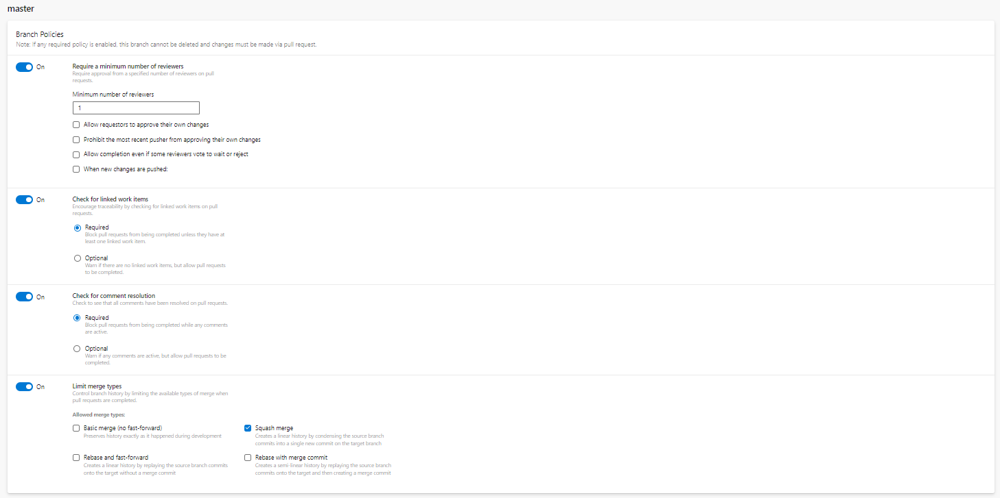

# Branching Strategy

**Project type**: Middle/Large

**Branching strategy type**: GitHub flow

**Git repository**: Azure Repos

### General Process

The general branching process is based on the [GitHub flow](https://docs.github.com/en/get-started/quickstart/github-flow) documentation. This process is sufficient and necessary for efficient collaboration in a Middle/Large project.

1. The `master/main` branch is the primary branch where code is branched from and merged to.
2. Developers work on their local machines and within their development branches.
3. Development branches are created using naming conventions to ensure consistency and accuracy in the development process.
4. Changes are committed locally and pushed to the remote Azure Repository.
5. A Pull Request is created in Azure DevOps.
6. The Pull Request is reviewed and approved.
7. Code is merged into the `master/main` branch.

### Pull Request Setup

1. Go to: Project settings -> Repositories -> -> Policies -> Branch Policies -> \<master/main branch>
2. Set the following parameters:

* **Require a minimum number of reviewers**: ON
  * **Minimum number of reviewers**: 1
* **Check for linked work items**: Required
* **Check for comment resolution**: Required
* **Limit merge types**: ON
  * **Squash merge**: true
* **Automatically included reviewers**: Add at least one required reviewer.

<figure><figcaption><p>Master/main branch pilicies</p></figcaption></figure>

### Branch Naming Conventions

`<group-token>/<item-number>/<branch-name>`

1. Use grouping tokens: Group tokens represent folders in the Azure DevOps Branch.
   * `wip`: Works in progress; stuff that won't be finished soon.
   * `feat`: Feature being added or expanded.
   * `bug`: Bug fix or experiment.
   * `junk`: Throwaway branch created for experimentation.
2. Use a forward slash as the separator. Azure DevOps Services, TFS, and Visual Studio treat "/" as a folder separator and will automatically collapse folders by default.
3. Add the item number: The item number is the number of the work item in the Azure DevOps backlog.
4. Add the branch name: The branch name should be a short but meaningful string in the kebab case.

Example: `feat/467/branch-naming`

### Automation

To ensure consistency with the branch naming convention, set [TF Git Permission](https://learn.microsoft.com/en-us/azure/devops/repos/git/require-branch-folders?view=azure-devops\&tabs=browser).

1.  Block the Create Branch permission at the repository root for the project's contributors

    
    ```bash
    tf git permission   /deny:CreateBranch /group:"%groupContributor%" /collection:%collection% /teamproject:"%teamproject%" /repository:"%repository%"
    ```
    
2.  Allow contributors to create branches under `wip`

    
    ```bash
    tf git permission   /allow:CreateBranch /group:"%groupContributor%" /collection:%collection% /teamproject:"%teamproject%" /repository:"%repository%" /branch:wip
    ```
    
3. Do the same for all group-token folders. The full script is `tf-git-permission.cmd` in the `tools` directory of the `power-platform-alm` repository
4. Enforce adherence to the branch naming convention through the pull request process

**Note:** [Git Server-Side hooks](https://git-scm.com/book/en/v2/Customizing-Git-Git-Hooks) are not implemented in Azure DevOps, therefore the best way to ensure branch naming conventions on the server side is to set Azure Repo branch permissions with TFS.
