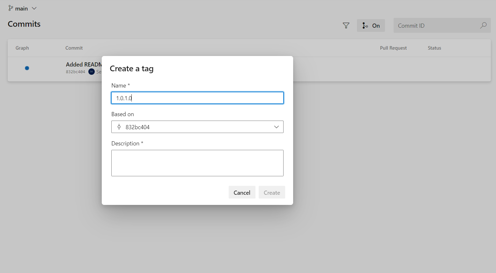

# Code Versioning with Git Tags

## Code Versioning

### Use Semantic Versioning

Power Platform solution versioning structure: `MAJOR.MINOR.BUILD.REVISION`.

The Power Platform utilizes this schema when leveraging its built-in tools for managing solutions, such as export, import, and patching. Within our current application lifecycle management framework, we consider solutions as code and apply software engineering best practices. This approach transforms the schema into a traditional Semantic Versioning methodology.

`MAJOR.MINOR.PATCH.EXPORT`

`MAJOR` - breaking changes in core solutions (CR-CA, CR-CL, CR-C)&#x20;

`MINOR` - custom feature changes or minor changes in core solutions

`PATCH` - bug fixes and minor updates either in core solution or in custom feature solutions&#x20;

`EXPORT` - don't change this number: we don't use it in the ALM process, this number is incremented by the system when the solution is exported

Example: `1.0.1.0`,

where

* 1 - implemented code solution with basic functionality
* 0 - no custom feature solutions were added
* 1 - bug fix in one of the core solutions
* 0 - do not use this number, always use 0

### Create Git tag with Azure DevOps

Use lightweight git tags and semantic versioning, carefully considering which commits should be included in each release, and assigning version numbers consistently to create effective Semantic Releases

* Go to: Repos -> Commits
* Select the `main` branch
* Select commit
* Create a new version tag
  * _name_: string with the semantic version
  * _description_: a brief description of the code changes

<figure><figcaption>
Create Git tag with Azure DevOps
</figcaption></figure>

### Automate deployment with Semantic Version + Git tags

Solution deployments are automated with Azure DevOps Pipeline in YAML format. The pipeline implements deployment of the specified version with Semantic Versioning and Git tags

### Deployment Pipeline

#### Triggers

The pipeline can be triggered manually

TBD (describe pipeline triggers when implemented)

#### Select the right version of the code

1.  **Validate version parameter** The version number can be passed to the pipeline when it is run manually.

    The version value can be both semantic
2. **Set version as a pipeline parameter**
3. **Checkout specified tag**

### Adjust Solution.xml version with Git tag version

TBD
